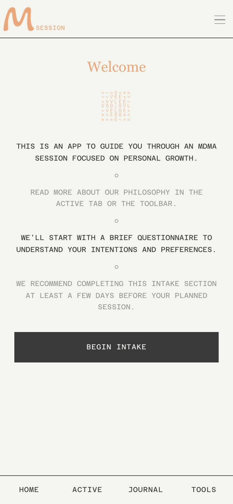
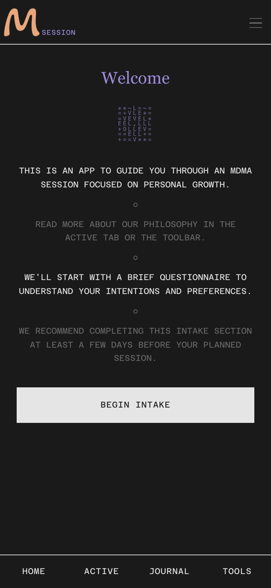

# M-SESSION

[](https://github.com/wellwellwellyourefeelingfine/m-session/actions/workflows/ci.yml)
[](LICENSE)
[](https://m-session.com)
[](CONTRIBUTING.md)

A privacy-first companion for intentional MDMA experiences. M-SESSION guides you through every phase of a therapeutic session — from preparation and intention-setting through guided meditations, journaling, and post-session integration — all running locally on your device with no accounts, no cloud, and no data collection.

**[Try it at m-session.com](https://m-session.com)**

<p align="center">
  
  &nbsp;&nbsp;&nbsp;&nbsp;
  
</p>

---

## Features

**Guided Session Flow**
- 4-section intake questionnaire that generates a focus-aware activity timeline (11 configurations across 5 focus areas + 3 guidance levels)
- Customizable timeline editor — reorder, add, remove, and adjust durations
- Substance checklist with dosage safety gates and testing reminders
- Pre-session ritual with intention-setting and centering breath
- 3-phase active session (come-up, peak, synthesis) with human-driven transitions
- 8-step closing ritual capturing self-gratitude, future messages, and commitments
- Follow-up phase (unlocked 8h post-session) with time-locked check-ins and a growing library of MAPS-inspired integration activities

**17+ Activity Modules**
- 11 audio-synced guided meditations with pre-recorded TTS voice guidance
- Breath meditation with animated BreathOrb visualization
- 6 journaling types (light, deep, letter-writing, parts-work, therapy-exercise, general)
- Values Compass (ACT Matrix) with interactive drag-and-drop + PNG export
- Music listening and dance modules with native alarm integration
- Open space for freeform rest

**Therapeutic Frameworks**
- Internal Family Systems (IFS) — Protector Dialogue (2-part guided activity)
- Acceptance and Commitment Therapy (ACT) — Leaves on a Stream, Values Compass
- Coherence Therapy — Stay With It (meditation + psychoeducation + journaling)
- Emotionally Focused Therapy (EFT) — The Descent + The Cycle (linked pair)
- Focusing — Felt Sense (2 variations)

**Privacy & Data**
- All data stays on-device (localStorage + IndexedDB)
- No accounts, no cloud sync, no tracking
- Export session data as text files at any time
- Session history with archive/restore via hamburger menu

**PWA**
- Installable on iOS, Android, and desktop
- Dark and light mode with monospace + serif typography
- Optional AI assistant (Anthropic, OpenAI, OpenRouter — bring your own key)

---

## Session Flow

```
1. INTAKE (4 sections: Experience, Intention, Preferences, Safety)
   └── Generates focus-aware module timeline based on primary focus + guidance level

2. PRE-SESSION (Timeline Editor)
   └── User customizes module order, durations, adds/removes activities

3. SUBSTANCE CHECKLIST (5 steps)
   ├── Substance ready
   ├── Substance testing
   ├── Dosage input (real-time feedback with safety gates at 151mg+ and 300mg+)
   ├── Prepare your space (checklist)
   ├── Supplemental dose prep (conditional — if booster selected in intake)
   └── Trusted contact & session helper

4. PRE-SESSION INTRO (6 steps + intention sub-flow)
   ├── Arrival
   ├── Intention menu (review intention / centering breath / skip)
   │   └── Intention sub-flow: focus reminder → touchstone → intention text
   ├── Letting Go
   ├── Take substance → records ingestion time
   ├── Confirm ingestion time (with adjustment option)
   └── Begin session → TransitionBuffer → startSession()

5. ACTIVE SESSION — COME-UP PHASE
   ├── Modules begin (grounding, breathing, music, etc.)
   ├── Come-up check-in overlay (minimizable, non-blocking)
   │   └── "Nothing yet" / "Starting to feel something" / "Fully arrived"
   └── "Fully arrived" → end-of-phase choice → PeakTransition

6. PEAK TRANSITION (6 steps)
   ├── "You've Arrived" — acknowledgment
   ├── One Word — capture current experience (text input)
   ├── Body Sensations — multi-select grid (8 options)
   ├── Tune In — reassurance
   ├── Let It Unfold — permission statement
   └── Begin → TransitionBuffer → enter peak phase

7. ACTIVE SESSION — PEAK PHASE
   ├── Peak-appropriate modules (meditation, music, journaling, open awareness)
   ├── Booster check-in (conditional — triggers 30 min after "fully arrived" or 90 min floor)
   │   └── Take / Skip / Snooze — expires silently at 150 min, hard cutoff at 180 min
   └── Peak phase check-in → IntegrationTransition

8. SYNTHESIS TRANSITION (5-9 steps, dynamic)
   ├── "The Peak Is Softening" — acknowledgment
   ├── Intention check-in — revisit + optional edit
   ├── Focus confirmation — keep or change primary focus
   │   └── (conditional) Focus selector + relationship sub-type
   ├── Tailored activity offer — journaling/compassion/reflection based on focus
   ├── Hydration reminder
   └── Begin → TransitionBuffer → enter synthesis phase

9. ACTIVE SESSION — SYNTHESIS PHASE
   ├── Synthesis-phase modules (deep journaling, parts work, letter writing, etc.)
   └── Closing check-in → ClosingRitual

10. CLOSING RITUAL (8 steps)
    ├── "Honoring This Experience" — acknowledgment
    ├── Self-gratitude — textarea capture
    ├── Message to future self — textarea capture
    ├── Commitment — textarea capture (with collapsible examples)
    ├── "This Session Is Complete"
    ├── "Before You Go" — data download prompt (text / JSON)
    ├── "Integration Takes Time" — encouragement to return for follow-up
    └── "Take Care" → Close Session → PostCloseScreen animation → Home

11. FOLLOW-UP (phase unlocked 8h after session, available on Home screen)
    ├── Time-locked modules (all unlock at 8h):
    │   ├── Check-In — feeling selector + body awareness + optional note
    │   ├── Revisit — re-read intention, future message, commitment + reflection
    │   ├── Values Compass Revisit (conditional — only if completed in session)
    │   └── Integration Reflection — what's emerged + commitment status check
    └── Integration activity library (user-selectable, MAPS-inspired):
        ├── Integration Reflection Journal, Relationships Reflection, Lifestyle Reflection
        └── Spirit & Meaning, Body & Somatic Awareness, Nature & Connection
```

---

## Tech Stack

| Category | Technology | Why |
|----------|------------|-----|
| Runtime | Node.js 22 LTS | Pinned via `.nvmrc` + `engines` in package.json |
| Framework | React 19 | Latest features, improved performance |
| Build | Vite 7 | Fast HMR, modern ES modules |
| State | Zustand | Minimal boilerplate, built-in persistence |
| Styling | Tailwind CSS 4 | CSS-first config, utility classes |
| PWA | vite-plugin-pwa | Offline capability |

---

## Core Philosophy

1. **Modular, extensible architecture** — 17+ lazy-loaded module types across meditation, journaling, therapeutic activities, and open-ended experiences, with a capability-based shell ready for config-only modules
2. **All views stay mounted** — meditation timers persist across tab switches via CSS `display: none`
3. **Phase transitions are human-driven** — the app guides, not dictates
4. **Audio-text synchronization** — pre-recorded TTS voice guidance with synced visual prompts, audio leading text by 200ms
5. **Privacy-first** — all data stays on-device with localStorage persistence and optional text export; no accounts, no cloud sync

> **Terminology note:** The within-session Phase 3 is called "Synthesis" in all user-facing content but `integration` in all internal code (to preserve compatibility with persisted user sessions in localStorage). "Integration" in this project refers to the community-standard concept of post-session therapeutic work. See [ARCHITECTURE.md](ARCHITECTURE.md) for the full rationale and developer guidance.

---

## Quick Start

**Requires Node.js 22 LTS** (pinned in `.nvmrc`). Node 25+ introduces breaking changes to JSON imports.

```bash
nvm use           # Switch to pinned Node version (22)
npm install
npm run dev       # Start dev server at localhost:5173
npm run build     # Production build
npm run preview   # Preview production build
```

---

## Architecture

For detailed developer documentation — directory structure, module system, audio pipeline, state management, design system, and more — see [ARCHITECTURE.md](ARCHITECTURE.md).

---

## Contributing

1. For new modules, prefer the capability-based approach first
2. Keep stores focused — consider splitting if they grow too large
3. Test on both light and dark modes
4. Verify tab switching doesn't break timer state
5. For audio modules, ensure graceful fallback to text-only
6. **Version numbers**: On significant releases, update both `version` in `package.json` and the display label in `src/components/layout/SessionMenu.jsx` (the `m-session vX.X` text in the hamburger menu)

See [ARCHITECTURE.md](ARCHITECTURE.md) for detailed conventions, directory structure, and how to add new modules.

---

## License

[AGPL-3.0](LICENSE)
